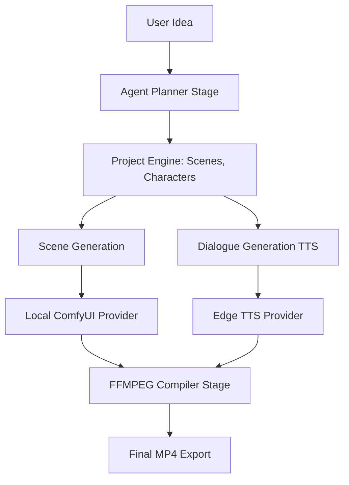

<div align="center">
  
  <h1>🎬 Noema Studio</h1>
  <p>An AI-native production studio for turning creative ideas into structured, coherent, and editable multimedia productions using local models (ComfyUI, Ollama) and cloud engines (OpenAI).</p>
  <p>
    <a href="https://flutter.dev/"></a>
    <a href="https://github.com/comfyanonymous/ComfyUI"></a>
    <a href="https://ollama.com/"></a>
  </p>
</div>

---

## 🌟 What is Noema Studio?

Noema Studio is **NOT** a clone of ComfyUI, nor is it a simple wrapper around Sora or Runway. It is an **AI Production and Orchestration Layer** that understands your complete project.

Instead of answering *"How do I execute a generation workflow?"*, Noema answers:
> *"What are we producing, how should it be produced, and how do we make characters and dialogue coherent?"*

You provide the Idea. Noema builds the Story, generates the Characters, scripts the Dialogue, produces the Video shots, generates Voiceovers (TTS), and automatically stitches everything into a final `.mp4` movie using FFMPEG.

### ✨ Key Features
- 🧠 **Story-Aware AI Planner:** Decomposes a simple idea into scenes, characters, and dialogue using Local LLMs (Ollama) or Cloud (OpenAI).
- 🗣️ **Multi-Character Dialogue:** Automatically routes TTS to different characters, generating conversational audio tracks.
- 🎬 **Video Looping & Compilation:** Intelligently loops short AI-generated video clips (like AnimateDiff/SVD) to match the length of the character dialogue, and compiles the final video locally.
- 🔌 **Provider Agnostic (Plugin Architecture):** Easily switch between Local ComfyUI, Sora, Runway, or Veo. 
- 🪄 **One-Click Auto Installer:** First time running? Noema will automatically download ComfyUI and clone required custom nodes for you!

## ⚙️ High-Level Architecture



## 🗺️ Roadmap & Status (v0.1.0-alpha)

Noema is currently in **Early Alpha**. We believe in transparency for the open-source community regarding what is working, what is in progress, and what is planned.

### ✅ Implemented
- **Project-Centric Architecture:** Robust `NoemaProject` aggregate root for tracking all creative assets.
- **True DAG Pipeline Engine:** Stage-level execution graph ensuring tasks process efficiently in correct dependency order.
- **Agent Planner (Ollama/OpenAI):** AI decomposing ideas into structured stories, scenes, and characters.
- **Provider Abstraction (V1):** Interface for plugging in `ImageProvider`, `TTSProvider`, `LLMProvider`.
- **Local Generation (ComfyUI):** Image generation using ComfyUI APIs and Job polling.

### 🚧 In Progress
- **Scene Audio (TTS):** Finalizing dialogue generation via local/cloud TTS.
- **Video Compilation:** Intelligent FFMPEG looping and stitching to match audio lengths.
- **Test Coverage:** Building integration tests for pipeline failover and project state persistence.

### 🔮 Planned (Future)
- **Capability-Based Orchestration:** Dynamic provider resolution (e.g., auto-routing to OpenAI if local ComfyUI lacks VRAM).
- **Custom Plugin Ecosystem:** Formal SDK for 3rd party providers (Runway, Sora, etc.).
- **Automatic Audio/SFX/Music:** Generative music synced to scene moods.


## 🚀 Getting Started

### Prerequisites
- Flutter SDK (3.x)
- FFmpeg (Must be installed and in your system PATH)
- Git (for Auto-Installer)

### Installation
1. Clone the repository:
   ```bash
   git clone https://github.com/NoemaDz/Noema-studio.git
   cd Noema-studio/app
   ```
2. Install Flutter dependencies:
   ```bash
   flutter pub get
   ```
3. Run the app (Desktop mode recommended):
   ```bash
   flutter run -d linux # or windows / macos
   ```

### First Launch (Auto-Setup)
On first launch, if you do not have ComfyUI installed, Noema's **Setup Wizard** will appear. It will automatically:
- Download the ComfyUI backend into your local AppData/ApplicationSupport folder.
- Install essential custom nodes (`ComfyUI_IPAdapter_plus`, `AnimateDiff`, etc.).

*Note: You will still need to manually download large Checkpoint (.safetensors) models into the ComfyUI models directory.*

## 🎛️ Settings & Configuration
Noema is designed to be highly configurable. Go to `File > Settings` to configure:
- **LLM Provider:** Choose between `Ollama` (Local) or `OpenAI` (Cloud).
- **TTS Provider:** Choose between `Flutter TTS`, `Edge TTS` (Free Cloud), or `OpenAI TTS`.
- **FFMPEG Default Effect:** Set default fallback camera effects (zoom, pan).

## 🆕 Recent Updates
- **DAG Pipeline Engine**: Replaced traditional sequential execution with a powerful Directed Acyclic Graph (DAG) orchestrator (`PipelineEngine`) to process tasks efficiently and securely in parallel at the stage level.
- **Robust JSON Extraction**: Added `JsonExtractor` to safely parse LLM outputs even if they contain markdown or hallucinations, ensuring the AI agent never crashes the pipeline.
- **Dynamic Shimmer UI**: Storyboard now features professional Shimmer effects while rendering images, and a live Pipeline Status tracker.
- **Robust Error Handling**: Added smart fallback mechanisms. If an advanced ComfyUI workflow is missing, Noema gracefully falls back to basic without breaking the pipeline.
- **Enhanced UI Feedback**: Live Progress Tracker now shows dynamic, context-aware job titles, and pipeline errors are surfaced immediately.

## 🤝 Contributing
Want to build a new plugin to support Runway ML? Or a new Stage for Lip-Syncing? We welcome contributions!
Please see [CONTRIBUTING.md](CONTRIBUTING.md) for details on how the Plugin Architecture works.

---
**Founder & Architect:** [NoemaDz](https://github.com/NoemaDz)
