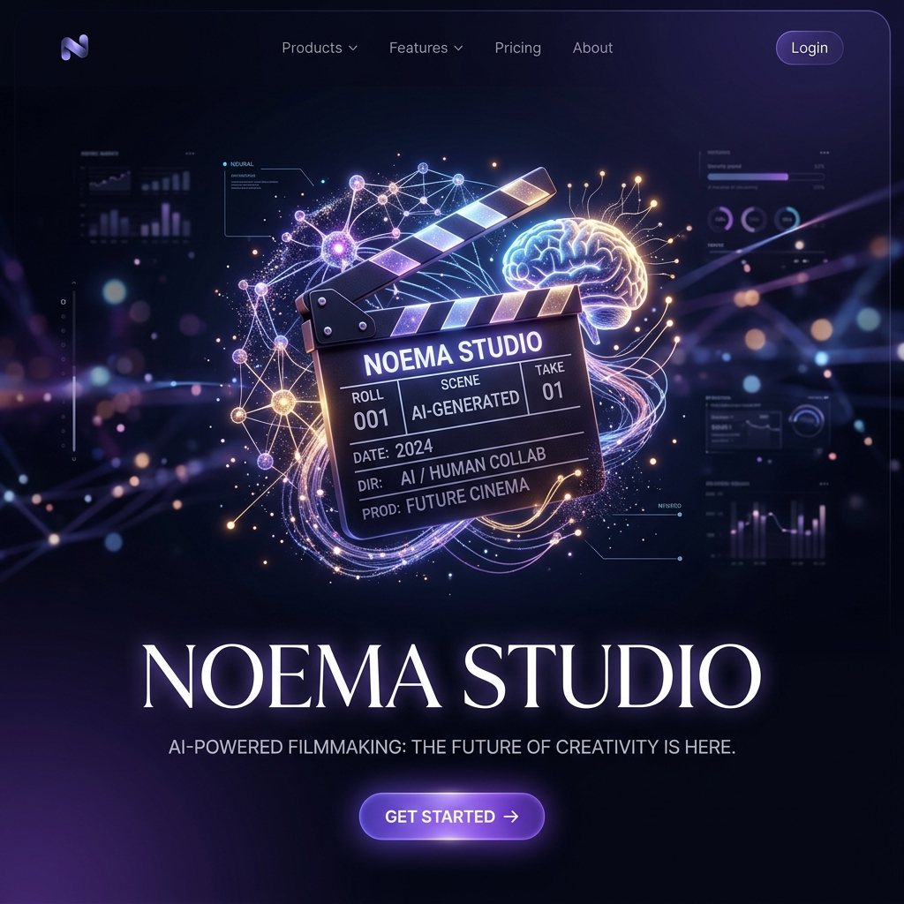
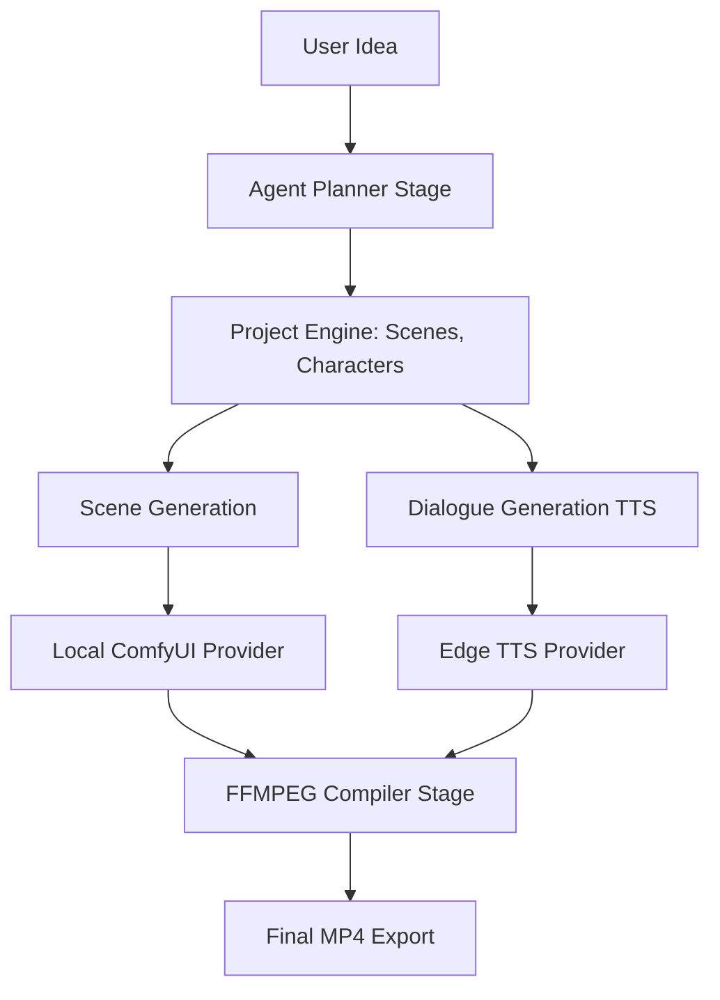

  
  <h1>🎬 Noema Studio</h1>
  
An AI-native production studio for turning creative ideas into structured, coherent, and editable multimedia productions using local models (ComfyUI, Ollama) and cloud engines (OpenAI).

  

    
    
    
  

---

## 🌟 What is Noema Studio?

Noema Studio is **NOT** a clone of ComfyUI, nor is it a simple wrapper around Sora or Runway. It is an **AI Production and Orchestration Layer** that understands your complete project.

Instead of answering *"How do I execute a generation workflow?"*, Noema answers:
> *"What are we producing, how should it be produced, and how do we make characters and dialogue coherent?"*

You provide the Idea. Noema builds the Story, generates the Characters, scripts the Dialogue, produces the Video shots, generates Voiceovers (TTS), and automatically stitches everything into a final `.mp4` movie using FFMPEG.

### ✨ Key Features
- 🧠 **Story-Aware AI Planner:** Decomposes a simple idea into scenes, characters, and dialogue using Local LLMs (Ollama) or Cloud (OpenAI).
- 🗣️ **Multi-Character Dialogue:** Automatically routes TTS to different characters, generating conversational audio tracks.
- 🎬 **Video Looping & Compilation:** Intelligently loops short AI-generated video clips (like AnimateDiff/SVD) to match the length of the character dialogue, and compiles the final video locally.
- 🔌 **Provider Agnostic (Plugin Architecture):** Easily switch between Local ComfyUI, Sora, Runway, or Veo. 
- 🪄 **One-Click Auto Installer:** First time running? Noema will automatically download ComfyUI and clone required custom nodes for you!

## ⚙️ High-Level Architecture

## 🗺️ Roadmap & Status (Release Candidate 1 - RC 1)

Noema Studio has officially reached **Release Candidate 1 (RC 1)** status. All core pipeline stages, error management, state transitions, job persistence, and pre-flight checks are production-hardened.

| Capability | Status | Description |
|---|---|---|
| **Story Planning** | Stable (RC 1) | Robust JSON extraction and fallback parsing from LLMs. |
| **Provider Abstraction** | Stable (RC 1) | Interface for plugging in various Image, Video, TTS, LLM providers. |
| **Job State Machine** | Stable (RC 1) | Formal `transitionTo()` state machine with `starting`, `retrying`, `cancelling`, `cancelled` states. |
| **ComfyUI Pre-flight Check**| Stable (RC 1) | Validates `/object_info` nodes & models pre-submission with zero-crash fallbacks. |
| **Output File Verification** | Stable (RC 1) | Validates local disk existence, non-zero file size, and extension formats. |
| **Project Persistence** | Stable (RC 1) | Auto-snapshots active jobs (`savedJobs`) allowing seamless job restoration after app restarts. |
| **Crash Recovery & Panic** | Stable (RC 1) | Global `CrashLogger` (`noema_crash.log`) and UI `ErrorBoundary` preventing red screens. |
| **VRAM Emergency Cleanup** | Stable (RC 1) | Sends `/free` and `/interrupt` signals to ComfyUI on cancellation or error. |
| **Character Generation** | Beta Candidate | Regional attention and IPAdapter composite character consistency. |
| **Image-to-Video (I2V)** | Beta Candidate | SVD integration via ComfyUI with hardware performance profiles. |
| **Multi-Voice (TTS)** | Beta Candidate | Character Voice Profiles mapped to speech synthesis. |
| **Video Compilation** | Beta Candidate | Intelligent FFmpeg looping and audio sync. |

---

## 🆕 Recent Updates (RC 1 Hardening)
- 🛡️ **Crash Recovery & Panic Handler**: Added global `CrashLogger` logging to `noema_crash.log` and wrapped the UI in a custom `ErrorBoundary` widget to eliminate Flutter Red Screens of Death.
- 🔍 **ComfyUI Pre-flight Validation**: Automatically queries `/object_info` before submitting prompts to detect missing nodes or models, triggering automatic fallback to standard text-to-image without crashing.
- 💾 **Job State Persistence**: Unfinished jobs are now snapshotted into `project.json` (`savedJobs`) and restored upon opening the project, allowing polling to resume after app restarts.
- ⚡ **VRAM Emergency Cleanup**: Automatic dispatch of `/free` memory and `/interrupt` requests to ComfyUI upon job cancellation or fatal errors to prevent VRAM memory leaks.
- ✅ **Strict Output Verification**: All generated outputs are verified on local disk (existence, >0 bytes size, valid file extension) before marking jobs completed.

## 🤝 Contributing
Want to build a new plugin to support Runway ML? Or a new Stage for Lip-Syncing? We welcome contributions!
Please see [CONTRIBUTING.md](CONTRIBUTING.md) for details on how the Plugin Architecture works.

---
**Founder & Architect:** [NoemaDz](https://github.com/NoemaDz)
