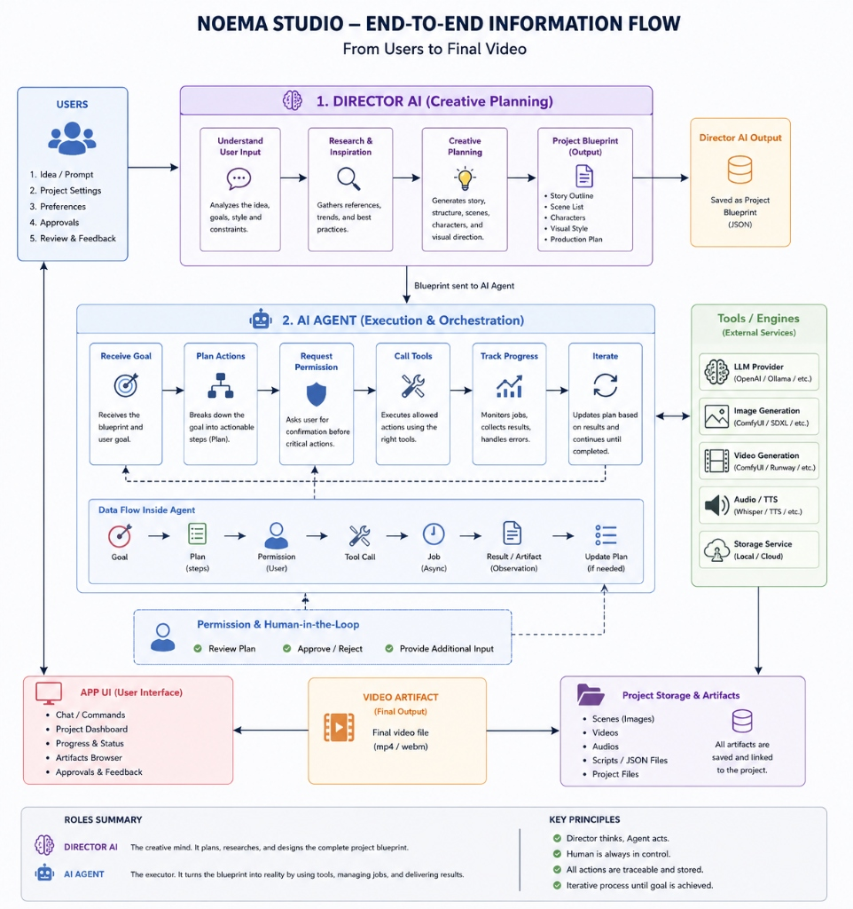

# Noema Studio Architecture

## End-to-End Information Flow

The application is structured into two main phases that follow a clear separation of concerns:

### 1. Director AI (Creative Planning)
The "Director" is responsible for understanding the user's intent and planning the project.
It outputs a **Project Blueprint** (saved as a JSON project file).
In the codebase, this maps to the `generatePlanning` phase, which includes stages like `StoryStage`, `CharacterStage`, and `ScenePromptStage`. The system pauses after this phase to allow the user to review and edit the blueprint.

### 2. AI Agent (Execution & Orchestration)
The "Agent" executes the approved blueprint. It orchestrates external tools to generate the final media.
In the codebase, this maps to the `generateProduction` phase. It uses a DAG-based `PipelineEngine` to run tasks in parallel (e.g., `SceneImageStage`, `SceneAudioStage`) and finally compiles the video (`VideoCompilationStage`).
It interacts with async providers like ComfyUI and Ollama through the `AgentToolbox` and tracks job progress via `JobManager` and `JobMonitor`. The "Human-in-the-Loop" step is integrated via permission requests during execution.
